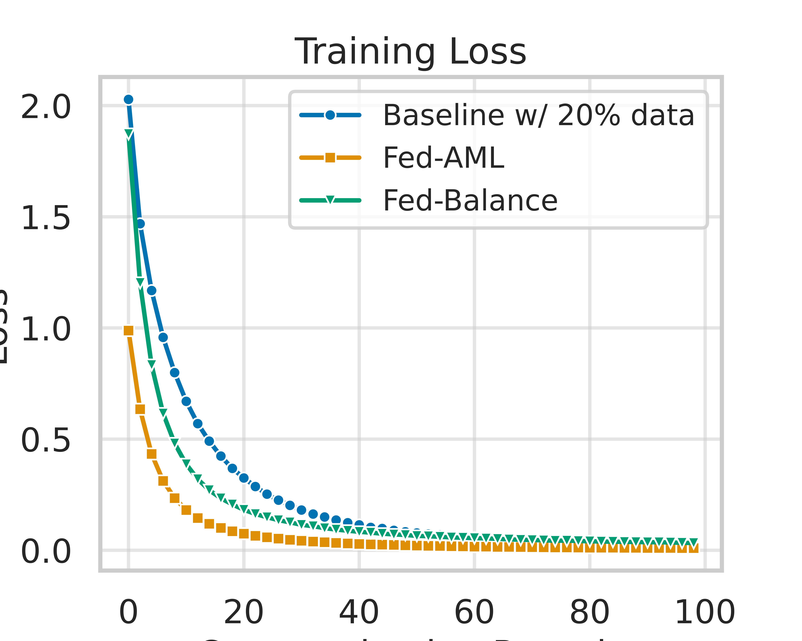
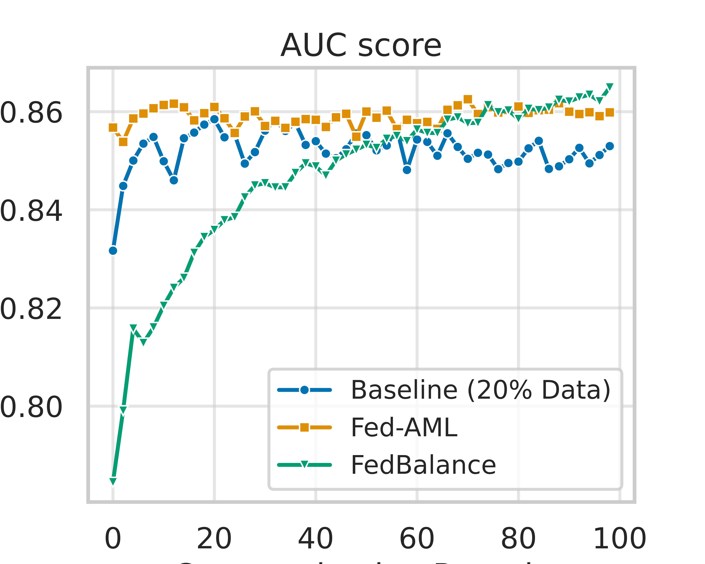
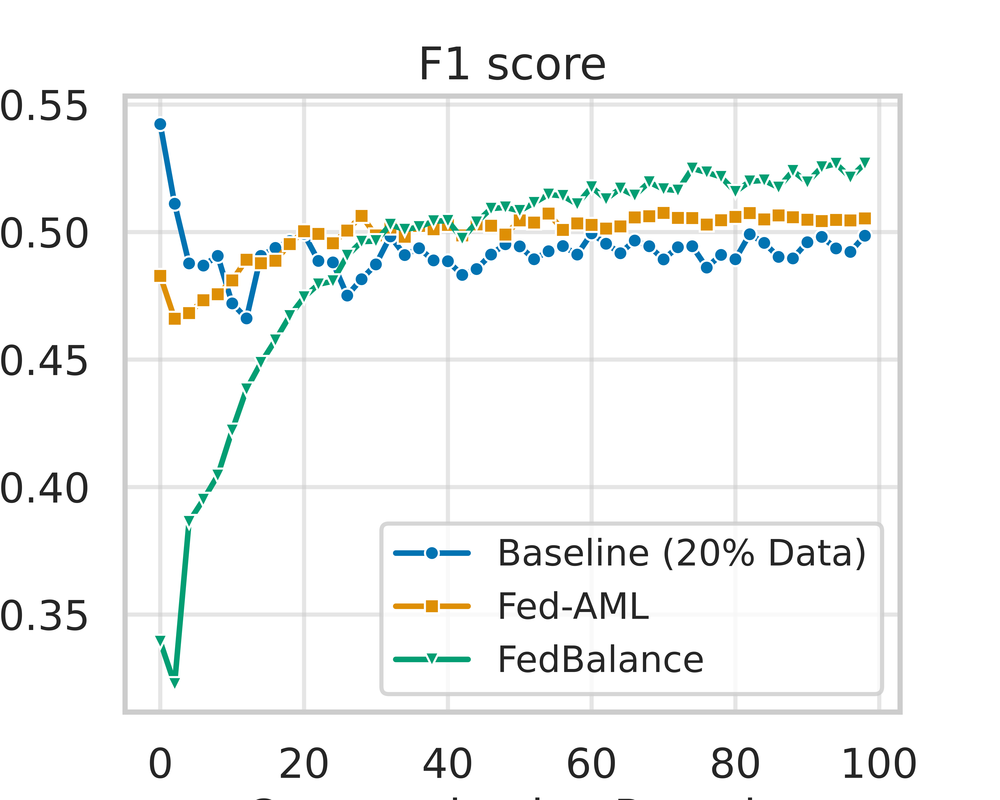

# Multi-Modal Federated Crime Intelligence System  
## Research Thrust 1 & Research Thrust 2

---

## Overview

This repository contains the implementation of our **Federated Multi-Modal Crime Intelligence Framework**, developed under two complementary research thrusts:

- **Research Thrust I (RT1): Federated Data Rebalancing And Meta-Learning**
- **Research Thrust II (RT2): Interdependent Crime Analytics Via Multi-Modal Fusion**

The overall goal is to build a **privacy-preserving, multi-source crime analysis system** that integrates:

- 🎥 Surveillance video frames  
- 🐦 Social media (Twitter) text  
- 📊 Crime-report spatiotemporal data  

All models are trained under a **Federated Learning (FL)** setting using ensuring decentralized training across clients.


## Contents

- [Installation](#installation)
- [Dataset](#dataset)
-Research Thrust 1  
-Research Thrust 2


## Installation

We recommend using **Anaconda** to manage dependencies.  
We use **Python 3.11** for training and evaluation.

```bash
conda create -n FedCrime python=3.10 -y
conda activate FedCrime
pip install -r requirements.txt
```


## Dataset

### 1️⃣ UCF-Crime Dataset 

We use the **UCF-Crime dataset** for video-based anomaly detection.

📥 **Download from the official source:**

https://www.kaggle.com/datasets/odins0n/ucf-crime-dataset

---

### ⚠️ Dataset Imbalance

The UCF-Crime dataset is **highly imbalanced**, with several crime categories significantly underrepresented compared to others.

Below is the class distribution visualization:


The severe imbalance motivates our **Federated Data Rebalancing (FedBalance)** strategy introduced in **Research Thrust 1**, which explicitly addresses label scarcity and skewed class distributions in decentralized environments.


# 🔹 Research Thrust 1  
## Federated Data Rebalancing 

To better simulate **real‑world data scarcity**, we use **20% of data** from UCF crime dataset and treat the remaining samples as **unlabeled**.

- **Baselines (centralized / non‑federated)**: trained on only **20% of the dataset** to mirror limited labeled data in practice.
- **FedBalance**: uses **20% labeled data per client** and leverages the remaining **80% as unlabeled data**.

### Run FedBalance

```
bash runbalance.sh
```
## Federated Adaptive Meta Learning

To simulate **real-world data scarcity**, we train the model using only **20% of the labeled data**.  
This setup reflects practical deployment scenarios where labeled surveillance data is limited and unevenly distributed across clients.

Federated Adaptive Meta Learning enables the model to quickly adapt to client-specific distributions while maintaining robust global generalization under constrained supervision.

### Run Federated Adaptive Meta Learning

```bash
bash run_meta.sh
```

## Experimental Results


We evaluate the models using:

- **AUC (Area Under ROC Curve)**
- **F1 Score**


We evaluate performance using **AUC** and **F1 score**, as both are well-suited for surveillance-based crime detection under severe class imbalance. **AUC** measures the model’s overall ability to distinguish between crime and non-crime events across all decision thresholds, making it robust to threshold selection and imbalance. **F1 score** balances precision and recall, ensuring the system both detects crime events (high recall) and minimizes false alarms (high precision). Together, these metrics provide a reliable assessment of discrimination capability and practical alert quality in real-world surveillance scenarios.

All experiments are conducted under the **20% labeled data constraint** to simulate realistic data scarcity.

 


Overall, Across both **AUC** and **F1 metrics**, **FedBalance and Fed-AML performs better than the baseline** , especially under:

- Limited labeled data (20%)
- Severe class imbalance
- Federated decentralized training


From the project root:


We preprocess the crime‐reporting data by converting event‐level records into fixed temporal windows to estimate contextual crime risk rather than detect individual incidents. Specifically, all timestamps are floored into hourly windows and grouped by semantic location type (e.g., street, bar or tavern, apartment). For each (location, hour) window, we compute the total number of reported incidents, and derive temporal attributes such as hour of day, day of week, and month. To obtain supervision without requiring explicit “no‐crime” labels, we define relative risk labels based on historical density: for each location type, we compute a per‐location incident count threshold using a training‐only quantile (e.g., the top 30% of windows). Windows whose incident counts exceed this threshold are labeled high crime likelihood, while the remaining windows are labeled low crime likelihood. This formulation yields a binary classification task that captures spatiotemporal risk patterns from historical data and produces a probabilistic risk prior that can be fused with video‐ and text‐based crime predictions.